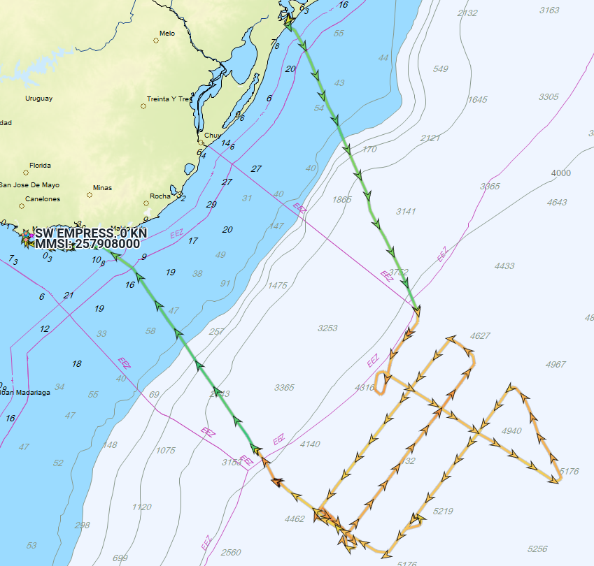
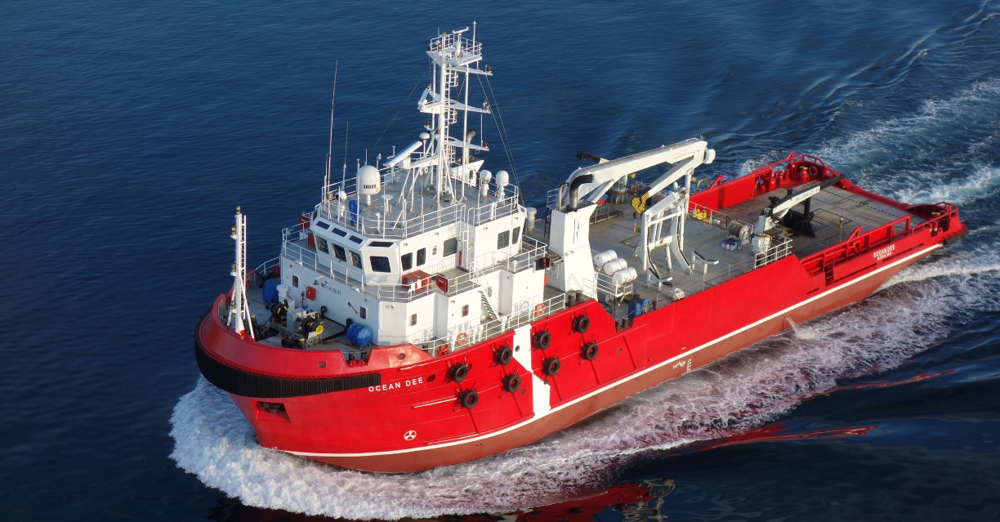
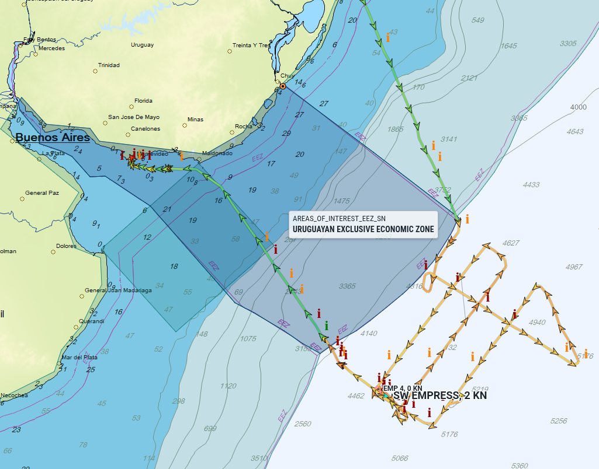
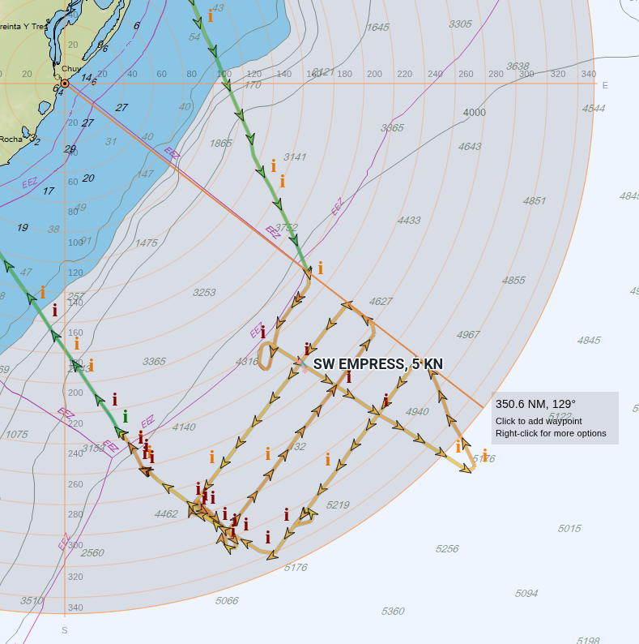

# SW EMPRESS: Prospección Sísmica en la Plataforma Continental Uruguaya

**Publicación #01 — 17 de abril de 2026**

Acusan de hacer exploración sísmica en la zona economica exclusiva (ZEE) de #Uruguay al buque de bandera noruega 🇳🇴 SW Empress.

- [Cruzan responsabilidades Cancillería, Ambiente y Ancap por buque noruego que realizó prospección sin autorización](https://www.uypress.net/Secciones/Cruzan-responsabilidades-Cancilleria-Ambiente-y-Ancap-por-buque-noruego-que-realizo-prospeccion-sin-autorizacion-uc152112) — Uypress
- [Buque noruego hizo exploración sísmica sin permiso en Uruguay: está en el Puerto de Montevideo](https://www.lr21.com.uy/ecologia/1494166-buque-noruego-hizo-exploracion-sismica-sin-permiso-en-uruguay-esta-en-el-puerto-de-montevideo) — La R

ANCAP menciona que operarian en "aguas internacionales", pero el Gobierno reclama soberanía hasta las 350 millas.

## El barco

El **SW Empress** (IMO: 9306026) es un buque sísmico de bandera noruega operado por **Shearwater GeoServices**, especializado en adquisición de datos sísmicos 2D y 3D. Fue contratado por la empresa **Searcher** para realizar un relevamiento de la plataforma continental en el Atlántico Sur.

## Reconstrucción del viaje desde datos AIS

Los datos del Sistema de Identificación Automática (AIS) permiten reconstruir el recorrido del buque entre el 2 y el 14 de abril de 2026.

| Fecha | Evento |
|---|---|
| **2 ABR** | Sale del Puerto de Rio Grande 🇧🇷 — destino AIS declarado: `OFFSHORE URUGUAY` |
| **3 ABR** | Cambia estado AIS a *Restricted Manoeuvrability* en aguas del Atlántico Sur — posiblemente el inicio de las operaciones sísmicas |
| **3–13 ABR** | Permanece en estado *Restricted Manoeuvrability*; navega a baja velocidad (2–4 nudos) en la zona de trabajo |
| **12–13 ABR** | El buque de apoyo OCEAN DEE 🇳🇴 opera en las inmediaciones — múltiples eventos de proximidad registrados en AIS |
| **13 ABR** | Cruza el límite de la ZEE uruguaya de 200 mn; cambia estado a *Underway using Engine* y acelera hacia Montevideo |
| **14 ABR** | Arriba al Puerto de Montevideo 🇺🇾 |

### Inicio de trabajos: cambio de estado a "Restricted Manoeuvrability"

**3 de abril, 20:25 (UTC-3):** El buque cambia su estado AIS de *Underway using Engine* a **Restricted Manoeuvrability** en las coordenadas `36°36'S, 50°30'W`.

El estado *Restricted Manoeuvrability* (Maniobra Restringida) es el estatus AIS que los buques sísmicos utilizan durante las operaciones de trabajo activo. Indica que el buque no puede maniobrar libremente porque está arrastrando equipos (streamer sísmico, air guns), lo que limita su capacidad de respuesta ante otras embarcaciones.

Este cambio de estado es consistente con el inicio de operaciones sísmicas activas, aunque no es posible confirmarlo con certeza solo a partir del AIS. La posición registrada en ese momento queda **fuera de las 200 millas náuticas** de la ZEE uruguaya.

### Zona de trabajo

Durante aproximadamente **diez días** (3 al 13 de abril), el SW Empress mantuvo estado *Restricted Manoeuvrability* navegando a velocidades bajas (2–4 nudos). Este patrón —velocidad reducida, rumbos paralelos, posición sostenida— es compatible con operaciones de adquisición sísmica, aunque el AIS por sí solo no permite confirmar qué actividad específica se realizaba.

Según las coordenadas registradas, el área de operación se encontraría en el rango aproximado de **270 a 320 millas náuticas** desde las líneas de base uruguayas — dentro de la **zona en disputa** entre el límite de las 200 mn (ZEE) y el de las 350 mn (plataforma continental extendida reconocida por la ONU en 2016).

### El OCEAN DEE: buque de apoyo sísmico

**12 y 13 de abril:** Los datos AIS registran múltiples eventos de **proximidad entre el SW Empress y el OCEAN DEE** (también de bandera noruega, operado por **Atlantic Offshore**).

El **OCEAN DEE** es un *seismic support vessel* de Atlantic Offshore ([ver flota](https://atlantic-offshore.no/fleets/ocean-dee/)), diseñado para asistir a buques sísmicos en operaciones de campo. Su presencia en las inmediaciones reforzaría la hipótesis de que las operaciones del 12 y 13 de abril seguían activas, aunque no es posible determinarlo con certeza a partir del AIS.

### Ingreso a la ZEE de 200 mn y fin de trabajos

**13 de abril:** El SW Empress **entra a la Zona Económica Exclusiva de Uruguay** (200 mn) en las coordenadas `37°43'S, 52°30'W`/

Horas más tarde, cambia su estado AIS de *Restricted Manoeuvrability* a **Underway using Engine** en las coordenadas `36°57'S, 53°10'W`, y acelera a 13 nudos. El salto de velocidad sugiere el fin de las operaciones y el inicio del tránsito hacia Montevideo. En ese mismo momento, el destino AIS cambia de `OFFSHORE URUGUAY` a `MONTEVIDEO`.

### Llegada a Montevideo

**14 de abril, 14:05 (UTC-3):** El SW Empress **arriba al Puerto de Montevideo**, asistido por los remolcadores VB Tero y VB Tannat. Permanece atracado en el puerto.

## Conclusión técnica

Según los datos AIS, el área principal de trabajo del SW Empress se ubicó **fuera de las 200 mn** pero **dentro del límite de 350 mn** reconocido por la ONU. Eso coloca las operaciones exactamente en el centro de la disputa jurídica.

Lo que los datos AIS muestran de forma objetiva es que el SW Empress mantuvo estado *Restricted Manoeuvrability* durante aproximadamente diez días en una zona que, según el aval de la ONU de 2016, formaría parte de la plataforma continental sobre la que Uruguay reclama derechos soberanos. La presencia del OCEAN DEE, un buque de apoyo sísmico, sugiere que no se trató de un tránsito casual sino de una operación planificada.

Lo que los datos AIS no pueden confirmar por sí solos es la naturaleza exacta de las actividades realizadas ni si existían autorizaciones de algún tipo. Esa es materia de la investigación en curso.

*Datos: MarineTraffic AIS Export — SW EMPRESS, abril 2026. [[positions.csv](positions.csv)]*  
*Fuentes institucionales: Uypress, PIT-CNT/Intergremial Marítima, Diario La R.*  
*Análisis: LU1AAT / CX9CAT — [AIS Rio de la Plata](https://lu1aat.github.io/ais-rio-de-la-plata/)*

---

## Imágenes

Recorrido completo (Marine Traffic), ZEE 200mn:

Recorrido completo (Marine Traffic), proyeccion de ZEE 350mn:

